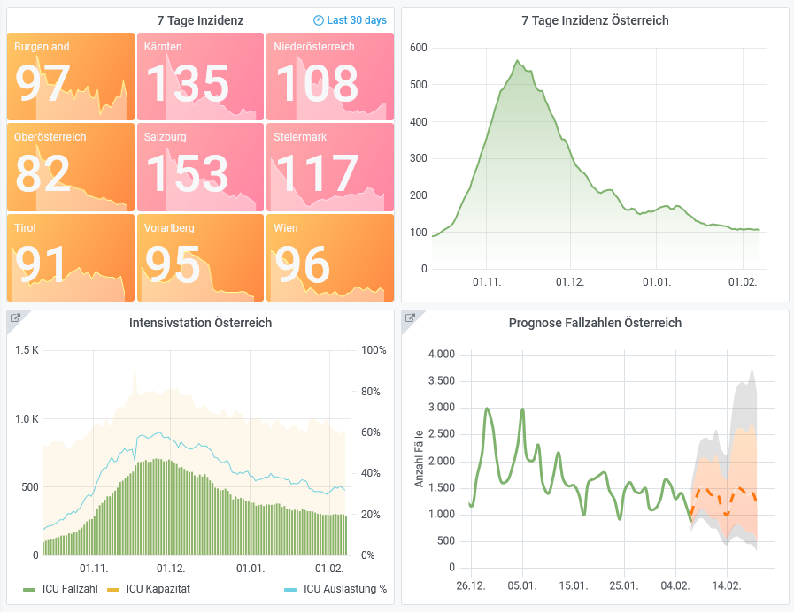

# cvdashboard: COVID-19 Dashboard for Austria

Grafana Dashboard with Postgres backend, based on data provided by [AGES/Open Data Austra](https://www.data.gv.at/covid-19/)

See it live: [covid.greenwasp.at](https://covid.greenwasp.at)



# How to run it

You need docker, docker-compose, sed and curl. Tested on Linux only.

start the services:
```sh
docker-compose up -d
```

create database and import data:
```sh
 sh scripts/download-data.sh
 sh scripts/init-db.sh
```

open grafana: http://localhost:3000

update to newest release (all changes made in the grafana ui will be lost), delete containers and start over from the top:
```sh
docker-compose stop
docker-compose rm -fv
```
